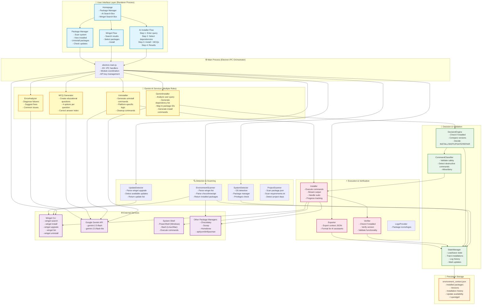
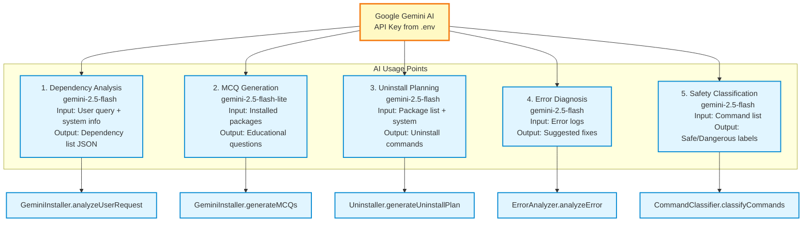

# 🔄 QuestGPT ARCHITECTURE FLOWCHARTS
**Accurate Visual Documentation**  
*Date: February 16, 2026*

---

## ❌ ISSUES WITH YOUR ORIGINAL FLOWCHART

### 1. **Oversimplified Linear Flow**
Your flowchart shows a single linear path, but QuestGPT has **3 DISTINCT FLOWS**:
- **AI Installer Flow** (natural language → Gemini → dependencies)
- **Winget Direct Flow** (search → select → install)
- **Package Manager Flow** (scan → manage → uninstall)

### 2. **Missing Critical Components**
Your flowchart is missing:
- ❌ **Uninstaller** (uses Gemini AI for generating uninstall commands)
- ❌ **Update Detector** (checks for package updates via `winget upgrade`)
- ❌ **Error Analyzer** (uses Gemini to diagnose failures)
- ❌ **Command Classifier** (safety validation)
- ❌ **Project Scanner** (detects project dependencies)
- ❌ **Exporter** (exports context for AI assistants)
- ❌ **Logo Provider** (UI asset management)

### 3. **Incorrect "AI Chat" Label**
There's NO chat interface. The AI is used for:
- 🎯 One-time dependency analysis (not ongoing chat)
- 📝 MCQ generation (educational, not conversational)
- 🗑️ Uninstall command generation
- 🔍 Error diagnosis (when installations fail)

### 4. **Gemini AI Has MULTIPLE Roles**
Your flowchart shows Gemini as a single external service, but it's called for:
1. **Analyzing user queries** → Generate dependency list
2. **Generating MCQs** → Educational content during install
3. **Safety validation** → Classify commands as safe/dangerous
4. **Uninstall planning** → Generate platform-specific uninstall commands
5. **Error analysis** → Diagnose why installations failed

### 5. **Decision Engine Misleading**
You show "Local Decision Engine" but reality is:
- ✅ **StateManager** tracks installed packages locally
- ✅ **DecisionEngine** decides: Install/Skip/Update/Repair
- ⚠️ **But initial analysis is done by Gemini AI** (not purely local)

### 6. **Missing IPC Layer**
The flowchart doesn't show **electron-main.js** orchestrating everything via IPC handlers between:
- **Renderer Process** (UI in Chromium)
- **Main Process** (Node.js backend)

### 7. **Incorrect Flow Order**
You show: System Detection → Environment Scanner → Decision Engine

But actual flow is:
1. **System Detection** (once on startup)
2. **User Action** (search/scan/install)
3. **Different paths** depending on flow type
4. **StateManager** consulted throughout (not just at end)

---

## ✅ CORRECTED ARCHITECTURE FLOWCHARTS

### **VIEW 1: COMPLETE SYSTEM ARCHITECTURE**



---

### **VIEW 2: AI INSTALLER FLOW (Detailed)**

```mermaid
flowchart TD
    START[User enters query in AI Search:
    'python pandas docker nodejs']
    
    START --> IPC1[IPC: analyze-request]
    
    IPC1 --> DETECT[SystemDetector
    OS: Windows 11
    PM: winget
    Arch: x64]
    
    DETECT --> GEM[GeminiInstaller
    Prompt includes:
    - User query
    - System info
    - 150+ verified packages
    - Platform-specific commands]
    
    GEM --> GEMINI_API[Gemini API Call
    gemini-2.5-flash]
    
    GEMINI_API --> PARSE[Parse AI Response
    Extract dependencies JSON]
    
    PARSE --> DEPS[Dependencies Array:
    1. Python 3.12
    2. pandas pip package
    3. Docker Desktop
    4. Node.js LTS]
    
    DEPS --> UI_SELECT[UI: Step 2 - Select Dependencies
    Show cards with:
    - Name, description, category
    - Install commands
    - Already installed badge]
    
    UI_SELECT --> STATE_CHECK[StateManager.isInstalled?
    Check environment_context.json]
    
    STATE_CHECK -->|Not installed| DECISION1[DecisionEngine: INSTALL]
    STATE_CHECK -->|Installed, same version| DECISION2[DecisionEngine: SKIP]
    STATE_CHECK -->|Installed, old version| DECISION3[DecisionEngine: UPDATE]
    
    DECISION1 --> USER_SELECT[User selects packages]
    DECISION2 --> USER_SELECT
    DECISION3 --> USER_SELECT
    
    USER_SELECT --> SAFETY[CommandClassifier
    Check all commands for:
    - Destructive operations
    - System-wide changes
    - Dangerous flags]
    
    SAFETY -->|Safe| PREVIEW[UI: Safety Preview Modal
    Show all commands to execute]
    SAFETY -->|Dangerous| BLOCK[Block installation
    Show warning]
    
    PREVIEW --> CONFIRM{User confirms?}
    CONFIRM -->|No| CANCEL[Cancel installation]
    CONFIRM -->|Yes| SUDO{Windows?}
    
    SUDO -->|Yes| INSTALL_WIN[Start installation
    No sudo needed]
    SUDO -->|No| SUDO_PROMPT[Prompt for sudo password]
    
    SUDO_PROMPT --> INSTALL_UNIX[Start installation
    with sudo]
    
    INSTALL_WIN --> LOOP_START[For each dependency...]
    INSTALL_UNIX --> LOOP_START
    
    LOOP_START --> CHECK_INST[Check if already installed
    IPC: check-installed]
    
    CHECK_INST -->|Already installed| SKIP_PKG[updateProgressItem: SKIPPED]
    CHECK_INST -->|Not installed| INSTALL_PKG[IPC: install-dependency]
    
    INSTALL_PKG --> EXEC[Installer.installDependency
    Execute commands sequentially
    Stream terminal output]
    
    EXEC --> CMD1[Command 1: winget install Python.Python.3.12]
    CMD1 --> CMD2[Command 2: pip install pandas]
    CMD2 --> SUCCESS{Success?}
    
    SUCCESS -->|Yes| VERIFY[Verifier.verifyInstallation
    Check: python --version]
    SUCCESS -->|No| ERROR[ErrorAnalyzer
    Diagnose failure with Gemini]
    
    VERIFY -->|Verified| UPDATE_STATE[StateManager.logInstallation
    Mark as installed
    Save to environment_context.json]
    
    VERIFY -->|Failed| ERROR
    
    ERROR --> SHOW_ERR[updateProgressItem: FAILED
    Show error message]
    
    UPDATE_STATE --> NEXT{More packages?}
    SKIP_PKG --> NEXT
    SHOW_ERR --> NEXT
    
    NEXT -->|Yes| LOOP_START
    NEXT -->|No| MCQ_START[Generate MCQs
    IPC: generate-mcqs]
    
    MCQ_START --> GEM_MCQ[GeminiInstaller.generateMCQs
    gemini-2.5-flash-lite
    Create questions about installed packages]
    
    GEM_MCQ --> SHOW_MCQ[UI: Display MCQ Quiz
    Auto-advance every 15s
    Track score]
    
    SHOW_MCQ --> COMPLETE[Installation Complete Modal
    Show:
    - Success count
    - Failed count
    - MCQ score
    - Export option]
    
    COMPLETE --> EXPORT{User clicks Export?}
    
    EXPORT -->|Yes| EXP[Exporter.exportContext
    Generate JSON with:
    - System info
    - Installed packages
    - Versions
    - Commands used]
    
    EXPORT -->|No| END[Return to homepage]
    EXP --> END

    classDef startClass fill:#c8e6c9,stroke:#388e3c,stroke-width:3px
    classDef aiClass fill:#fff9c4,stroke:#f57f17,stroke-width:2px
    classDef execClass fill:#ffccbc,stroke:#d84315,stroke-width:2px
    classDef successClass fill:#b2dfdb,stroke:#00796b,stroke-width:2px
    classDef errorClass fill:#ffcdd2,stroke:#c62828,stroke-width:2px

    class START startClass
    class GEM,GEMINI_API,GEM_MCQ aiClass
    class EXEC,CMD1,CMD2 execClass
    class UPDATE_STATE,COMPLETE successClass
    class ERROR,SHOW_ERR,BLOCK errorClass
```



---

### **VIEW 3: WINGET DIRECT FLOW**

```mermaid
flowchart LR
    HOME[Homepage
    Winget Search Box]
    
    HOME -->|User types 'python'| LOADING[Show Loading Overlay
    Fullscreen with blur
    'Searching Winget...']
    
    LOADING --> IPC[IPC: winget-search
    electron-main.js]
    
    IPC --> PARSE[parseWingetSearchOutput
    Handle progress bar prefix
    Detect 'Name' column offset
    Split by 2+ spaces]
    
    PARSE --> EXEC[Execute:
    winget search python 
    --count 20 
    --disable-interactivity]
    
    EXEC --> RESULTS{Results found?}
    
    RESULTS -->|Yes| DISPLAY[Navigate to Step 2
    Show package cards:
    - Name, ID, Version, Source
    - Click to select
    - 'Switch to AI' button]
    
    RESULTS -->|No| NO_RES[Show 'No Results'
    - Try AI Search button
    - Back to Home button]
    
    NO_RES -->|Click 'Try AI'| SWITCH[switchToAISearch
    Copy query to AI box
    Return to homepage
    Highlight text
    DO NOT auto-submit]
    
    DISPLAY --> SELECT[User selects packages
    Can select multiple
    Button updates count]
    
    SELECT --> INSTALL[Click 'Install Selected']
    
    INSTALL --> SAFETY[CommandClassifier
    Validate safety]
    
    SAFETY --> EXEC_LOOP[For each selected package...]
    
    EXEC_LOOP --> CMD[Execute:
    winget install --id Package.ID
    --accept-source-agreements
    --accept-package-agreements]
    
    CMD --> VERIFY[Verify installation
    winget list --id Package.ID]
    
    VERIFY --> STATE[StateManager.logInstallation
    Save to environment_context.json]
    
    STATE --> NEXT{More packages?}
    
    NEXT -->|Yes| EXEC_LOOP
    NEXT -->|No| DONE[Installation Complete
    Return to homepage]

    classDef uiClass fill:#e1f5ff,stroke:#0288d1,stroke-width:2px
    classDef execClass fill:#ffccbc,stroke:#d84315,stroke-width:2px
    classDef successClass fill:#b2dfdb,stroke:#00796b,stroke-width:2px

    class HOME,LOADING,DISPLAY,SELECT uiClass
    class EXEC,CMD,EXEC_LOOP execClass
    class STATE,DONE successClass
```



---

### **VIEW 4: PACKAGE MANAGER FLOW (Scan & Uninstall)**

```mermaid
flowchart TD
    START[Homepage
    Package Manager Banner
    Stats: — packages, — updates]
    
    START --> SCAN[User clicks 'Scan System']
    
    SCAN --> IPC1[IPC: scan-environment
    electron-main.js]
    
    IPC1 --> ENV[EnvironmentScanner
    Execute: winget list]
    
    ENV --> PARSE1[parseWingetList
    Handle progress bar
    Extract: Name, ID, Version, Source]
    
    PARSE1 --> PKG_LIST[Return array of packages
    47 packages found]
    
    PKG_LIST --> UPDATE_CHECK[IPC: check-updates
    UpdateDetector]
    
    UPDATE_CHECK --> UPD_PARSE[Execute: winget upgrade
    parseWingetUpgrade
    Handle prefix bug
    Find updates]
    
    UPD_PARSE --> UPD_LIST[Return updates array
    5 updates available]
    
    UPD_LIST --> STATE_SAVE[StateManager
    Save packages to JSON
    Mark updates]
    
    STATE_SAVE --> UI_UPDATE[Update homepage stats:
    '47 packages • 5 updates available'
    Enable 'Manage Packages' button
    Change to 'Scan Again']
    
    UI_UPDATE --> USER{User clicks?}
    
    USER -->|Manage Packages| SHOW_PM[Show Package Manager View
    Table with:
    - Package name
    - Category
    - Version
    - Update badge
    - Uninstall button]
    
    USER -->|Scan Again| SCAN
    
    SHOW_PM --> UNINSTALL{User clicks uninstall?}
    
    UNINSTALL -->|Yes| CONFIRM[Confirm dialog
    'Uninstall package X?']
    
    CONFIRM -->|No| SHOW_PM
    CONFIRM -->|Yes| GEN_PLAN[IPC: generate-uninstall-plan
    Uninstaller + Gemini AI]
    
    GEN_PLAN --> GEMINI[Gemini generates:
    - Platform-specific commands
    - Cleanup commands
    - Warnings]
    
    GEMINI --> PREVIEW[Show Uninstall Preview Modal
    Review commands before execution]
    
    PREVIEW --> EXEC{User confirms?}
    
    EXEC -->|No| SHOW_PM
    EXEC -->|Yes| SUDO{Windows?}
    
    SUDO -->|No| SUDO_PROMPT[Prompt for sudo password]
    SUDO -->|Yes| RUN_UNINSTALL[Execute uninstall commands
    winget uninstall Package.ID]
    
    SUDO_PROMPT --> RUN_UNINSTALL
    
    RUN_UNINSTALL --> VERIFY[Verify removal
    Check if still in winget list]
    
    VERIFY --> UPDATE_STATE[StateManager.removePackage
    Update environment_context.json]
    
    UPDATE_STATE --> RESCAN[Auto-scan environment again
    Update package list]
    
    RESCAN --> SHOW_PM

    classDef scanClass fill:#e3f2fd,stroke:#1976d2,stroke-width:2px
    classDef aiClass fill:#fff9c4,stroke:#f57f17,stroke-width:2px
    classDef execClass fill:#ffccbc,stroke:#d84315,stroke-width:2px
    classDef successClass fill:#b2dfdb,stroke:#00796b,stroke-width:2px

    class SCAN,ENV,PARSE1,UPD_PARSE scanClass
    class GEN_PLAN,GEMINI aiClass
    class RUN_UNINSTALL execClass
    class UPDATE_STATE,RESCAN successClass
```



---

### **VIEW 5: STATE MANAGEMENT & PERSISTENCE**

```mermaid
flowchart LR
    subgraph RUNTIME["In-Memory Runtime State"]
        STATE_OBJ[StateManager Object
        - packages Map
        - installationHistory array
        - systemInfo object]
    end

    subgraph DISK["Persistent Storage"]
        JSON[~/.questgpt/environment_context.json
        {
          packages: {...},
          installationHistory: [...],
          lastScan: timestamp
        }]
    end

    subgraph EVENTS["State Modification Events"]
        INIT[App Startup
        StateManager.loadState]
        
        SCAN_EVT[Environment Scan
        Update packages]
        
        INSTALL_EVT[Package Installed
        Add to packages
        Log to history]
        
        UPDATE_EVT[Update Detected
        Mark update_available]
        
        UNINSTALL_EVT[Package Uninstalled
        Remove from packages]
        
        VERIFY_EVT[Verification Complete
        Update version info]
    end

    INIT --> JSON
    JSON --> STATE_OBJ
    
    SCAN_EVT --> STATE_OBJ
    INSTALL_EVT --> STATE_OBJ
    UPDATE_EVT --> STATE_OBJ
    UNINSTALL_EVT --> STATE_OBJ
    VERIFY_EVT --> STATE_OBJ
    
    STATE_OBJ --> JSON
    
    STATE_OBJ --> DEC[DecisionEngine reads state
    Decides: INSTALL/SKIP/UPDATE]
    
    STATE_OBJ --> UI[UI displays:
    - Stats (package count, updates)
    - 'Already installed' badges
    - Update badges]

    classDef runtimeClass fill:#fff3e0,stroke:#e65100,stroke-width:2px
    classDef diskClass fill:#f3e5f5,stroke:#7b1fa2,stroke-width:2px
    classDef eventClass fill:#e8f5e9,stroke:#388e3c,stroke-width:2px

    class STATE_OBJ runtimeClass
    class JSON diskClass
    class INIT,SCAN_EVT,INSTALL_EVT,UPDATE_EVT,UNINSTALL_EVT,VERIFY_EVT eventClass
```

---

### **VIEW 6: GEMINI AI INTEGRATION POINTS**



---

## 📊 KEY ARCHITECTURAL IMPROVEMENTS NEEDED

### 1. **Better Separation of Concerns**
Currently some modules do too much (GeminiInstaller handles both analysis AND MCQs). Consider:
```
GeminiInstaller → Only dependency analysis
MCQGenerator → Separate module for MCQs
```

### 2. **Cache Winget Results**
Every time you run `winget search`, it hits the network. Consider:
- Cache search results for 1 hour
- Store in StateManager
- Reduces latency for repeated searches

### 3. **Background Update Checking**
Currently updates only check when user clicks "Scan System". Better UX:
- Check for updates on app startup (background)
- Show badge count on Package Manager button
- Don't block UI while checking

### 4. **Retry Logic**
No automatic retry for failed network calls. Add:
- 3 retries for winget commands
- Exponential backoff for Gemini API
- Better error messages for offline scenarios

### 5. **Parallel Execution Option**
Currently installs are sequential (safe but slow). Consider:
- Allow parallel for independent packages
- Detect dependencies and install in DAG order
- User toggle: "Fast Mode" vs "Safe Mode"

### 6. **Better IPC Error Handling**
All IPC handlers should return consistent format:
```javascript
{
  success: boolean,
  data?: any,
  error?: { message: string, code: string }
}
```

---

## 🎯 SUMMARY: WHAT MAKES THIS ACCURATE

### ✅ **3 Distinct Flows Shown**
1. AI Installer (natural language)
2. Winget Direct (specific packages)
3. Package Manager (scan/uninstall)

### ✅ **All Components Included**
- SystemDetector
- EnvironmentScanner
- GeminiInstaller
- Installer
- Verifier
- Uninstaller
- UpdateDetector
- DecisionEngine
- CommandClassifier
- StateManager
- ErrorAnalyzer
- Exporter
- ProjectScanner
- LogoProvider

### ✅ **Gemini AI Multi-Role Shown**
5 different use cases documented

### ✅ **IPC Layer Explicit**
electron-main.js as orchestrator

### ✅ **State Persistence Clear**
StateManager ↔ environment_context.json

### ✅ **Real Flow Order**
Not linear - shows branches and decision points

---

**Use these flowcharts for:**
- 📖 Documentation
- 🎓 Onboarding new developers
- 🐛 Debugging complex flows
- 🏗️ Planning refactoring
- 🎤 Explaining to hackathon judges
